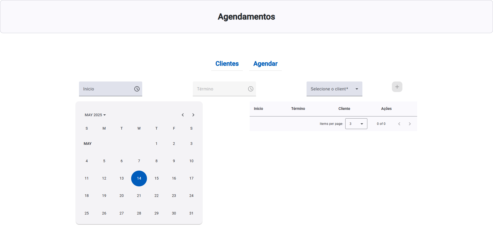

# BarberShopUi

## 🛠️ Sobre o Projeto - Criando um APP Full Stack de Agendamento de Barbearia com Java e Angular

Este projeto faz parte de um desafio de projeto da plataforma **[DIO](https://www.dio.me/)**, focado na criação de um APP Full Stack para o cadastro e agendamento de clientes em barbearias. Ele conta com um frontend intuitivo e um sistema eficiente para gerenciar os atendimentos, garantindo uma experiência fluida tanto para clientes quanto para profissionais. Além disso, possui uma API para o backend, proporcionando uma comunicação estruturada entre as partes do sistema.

## 🚀 Tecnologias Utilizadas  
- **Frontend:** Angular
- **Docker:** Para facilitar a implantação 
- **Backend:** Java (Spring Boot)
- **Banco de Dados:** MySQL ou PostgreSQL   

## 🔥 Principais Funcionalidades  
- Cadastro de clientes
- Agendamento de horários     
- Painel administrativo para a barbearia de cadastramento de clientes e agendamentos

## 🔗 API do Projeto  
Para acessar  o backend do projeto **[API](https://github.com/Jquest64/barber-shop-api)**, confira o repositório no GitHub.

This project was generated using [Angular CLI](https://github.com/angular/angular-cli) version 19.2.5.
